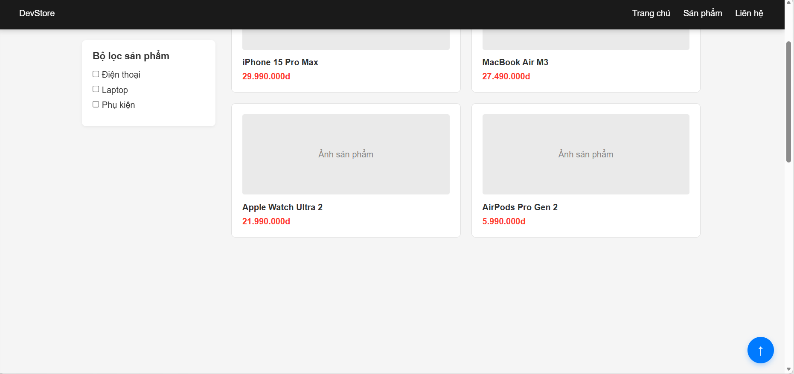
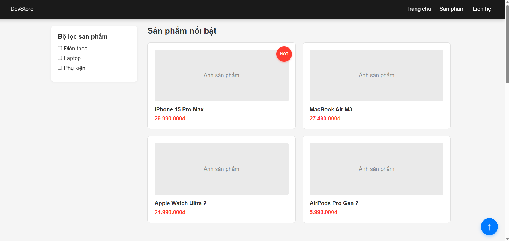
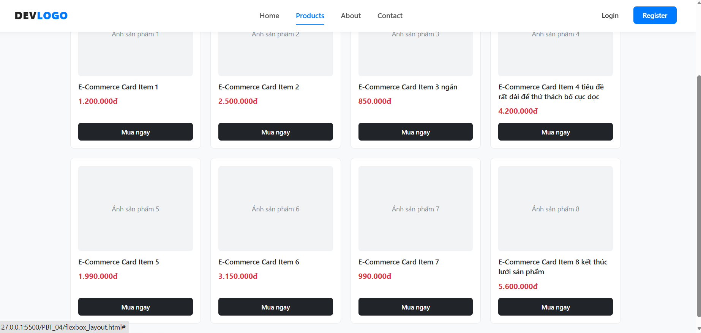

# PHIẾU BÀI TẬP 04
# **CSS LAYOUT — Positioning, Flexbox & Grid**

> **Tài liệu tham chiếu:** `12_css_positioning.md` + `13_creating_responsive_layouts.md`
>
---

## PHẦN A — KIỂM TRA ĐỨC HIỂU (20 điểm)

### Câu A1 (10đ) — 5 Loại Positioning

| Position | Vận chuyển chỗ trong flow? | Tham chiếu vị trí | Cuộn theo trang? | Use case |
|---|---|---|---|---|
| `static` | Có (default) | Không dùng `top/left/...` | Có | Mặc định cho phần lớn phần tử |
| `relative` | Vẫn trong flow | Dựa theo vị trí gốc của chính nó (vẫn chiếm chỗ cũ) | Có | Dùng làm “mốc” cho `absolute` con hoặc dịch nhẹ |
| `absolute` | 
 Ra khỏi flow | Theo **nearest positioned ancestor** (cha gần nhất có `position` khác `static`); nếu không có thì theo `body`/viewport | 
 Không cuộn theo phần tử cha (bám mốc tham chiếu) | Badge, dropdown, tooltip cần bám góc |
| `fixed` | 
 Ra khỏi flow | Theo viewport (màn hình) | 
 Không cuộn theo trang | Chat button, modal overlay |
| `sticky` | Vẫn trong flow nhưng “dính” khi đạt ngưỡng | Theo ngưỡng `top/right/bottom/left` | Có (cho tới khi dính rồi giữ cố định tương đối) | Sticky header, sidebar |

**Câu hỏi thêm:**
- `absolute` tham chiếu **body** khi: **không có** tổ tiên nào (cha/ancestor) có `position` khác `static`.
- `absolute` tham chiếu **parent** khi: trong cây DOM, tồn tại **cha gần nhất** có `position` khác `static`.
- “nearest positioned ancestor” = phần tử **ancestor gần nhất** (tính từ phần tử con đi ngược lên DOM) mà có `position` là `relative/absolute/fixed/sticky` (khác `static`).

### Câu A2 (10đ) — Flexbox vs Grid

```css
/* Trường hợp 1 */
.container { display: flex; }
.item { flex: 1; }
/* 4 items => 1 hàng (1 row), vì flex mặc định flex-wrap: nowrap */
```
```text
┌─────────────────────────────────────────────────────────┐
│ [ Item 1 ] [ Item 2 ] [ Item 3 ]  [ Item 4 ]            |
└─────────────────────────────────────────────────────────┘
```

```css
/* Trường hợp 2 */
.container { display: flex; flex-wrap: wrap; }
.item { width: 45%; margin: 2.5%; }
/* 6 items => mỗi hàng chứa 2 items (vì 45% + 2.5% + 45% + 2.5% = 95%);
   => 3 hàng, 2 cột */

```
```text
┌─────────────────────────────────────────────────────────┐
│  [  Item 1 (45%)  ]             [  Item 2 (45%)  ]      │
│  [  Item 3 (45%)  ]             [  Item 4 (45%)  ]      │
│  [  Item 5 (45%)  ]             [  Item 6 (45%)  ]      │
└─────────────────────────────────────────────────────────┘
```
```css
/* Trường hợp 3 */
.container { display: flex; justify-content: space-between; align-items: center; }
/* 3 items => 1 hàng */
```
```text
┌─────────────────────────────────────────────────────────┐
│ [Item 1]                [Item 2]                [Item 3]│
└─────────────────────────────────────────────────────────┘
```
```css
/* Trường hợp 4 */
.container { display: grid; grid-template-columns: 200px 1fr 200px; gap: 20px; }
/* 3 items => 1 hàng, 3 cột (mỗi item vào 1 column) */
```
```text
┌─────────────────────────────────────────────────────────┐
│ [Item 1: 200px]   [Item 2: 200px]   [ Item 3: 200px]    │
└─────────────────────────────────────────────────────────┘
```
```css
/* Trường hợp 5 */
.container { display: grid; grid-template-columns: repeat(3, 1fr); gap: 10px; }
/* 7 items => 3 cột mỗi hàng => 3 hàng (2+2+3 hoặc 3+2+2 tuỳ thứ tự dòng);
   item cuối sẽ nằm ở hàng 3, cột 1 (tính theo thứ tự DOM) */
```

```text
┌─────────────────────────────────────────────────────────┐
│ [ Item 1 (1/3) ]    [ Item 2 (1/3) ]    [ Item 3 (1/3) ]│
│ [ Item 4 (1/3) ]    [ Item 5 (1/3) ]    [ Item 6 (1/3) ]│
│ [ Item 7 (1/3) ]                                        │
└─────────────────────────────────────────────────────────┘
```
---

## PHẦN B — THỰC HÀNH CODE (60 điểm)

### Bài B1 (15đ) — Positioning Playground:

1. Trạng thái header khi scroll (chứng minh header fixed)

;

2. Trạng thái sidebar khi scroll (chứng minh sticky)

;


3. Badge trên card

;

### Bài B2 (20đ) — Flexbox Navigation & Cards

;