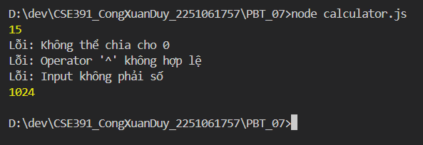
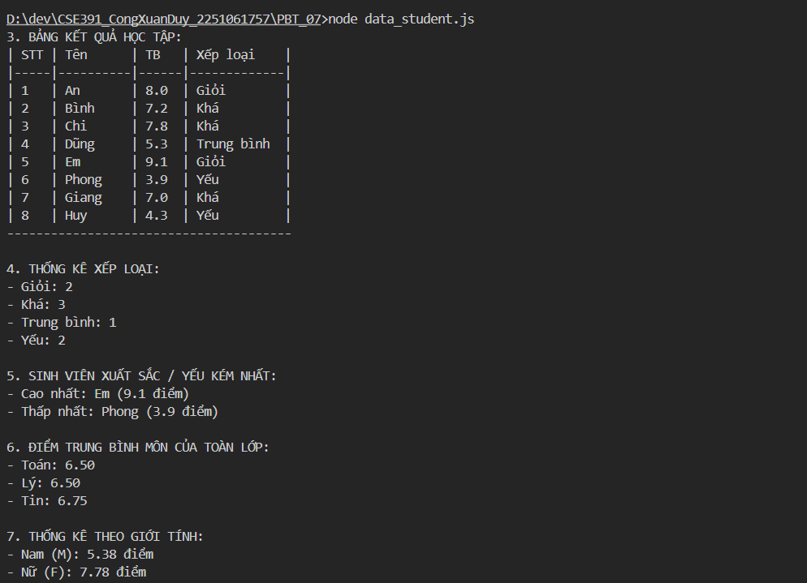

# PHIẾU BÀI TẬP 07
# **JAVASCRIPT BASICS — Variables, Data Types, Control Structures**

## PHẦN A — KIỂM TRA ĐỌC HIỂU (25 điểm)

### Câu A1 (5đ) — var / let / const

```javascript
// Đoạn 1
console.log(x);
var x = 5;

// Đoạn 2
console.log(y);
let y = 10;

// Đoạn 3
const z = 15;
z = 20;
console.log(z);

// Đoạn 4
const arr = [1, 2, 3];
arr.push(4);
console.log(arr);

// Đoạn 5
let a = 1;
{
    let a = 2;
    console.log("Trong block:", a);
}
console.log("Ngoài block:", a);
```

**1. Dự đoán kết quả:**
  - **Đoạn 1:** undefined (Do cơ chế Hoisting của var, biến được đưa lên đầu nhưng chưa được gán giá trị).
  - **Đoạn 2:** ReferenceError: Cannot access 'y' before initialization (Do let có cơ chế Hoisting nhưng bị đưa vào "Vùng chết tạm thời" - Temporal Dead Zone).
  - **Đoạn 3:** TypeError: Assignment to constant variable (Do const không cho phép gán lại giá trị mới).
  - **Đoạn 4:**[1, 2, 3, 4] (const không cho phép gán lại biến bằng một mảng khác, nhưng cho phép thay đổi/thêm bớt phần tử bên trong mảng/object đó).
  - **Đoạn 5:** 
    - Trong block: 2
    - Ngoài block: 1

    (Do let có phạm vi hoạt động theo khối (Block scope), biến a ở trong { } hoàn toàn độc lập với biến a ở ngoài).

### Câu A2 (5đ) — Data Types & Coercion
```javascript
console.log(typeof null);              // "object" 
console.log(typeof undefined);         // "undefined"
console.log(typeof NaN);               // "number" (NaN là "Not a Number" nhưng kiểu dữ liệu của nó vẫn thuộc nhóm số)
console.log("5" + 3);                  // "53"
console.log("5" - 3);                  // 2
console.log("5" * "3");                // 15
console.log(true + true);              // 2 (true bị ép kiểu thành 1: 1 + 1 = 2)
console.log([] + []);                  // "" (Chuỗi rỗng - Array bị ép thành chuỗi)
console.log([] + {});                  // "[object Object]"
console.log({} + []);                  // "[object Object]" 
```

**Giải thích tại sao "5" + 3 và "5" - 3 cho kết quả khác nhau:**
- Trong JavaScript, toán tử `+` có hai chức năng: cộng số học và nối chuỗi (String concatenation). Khi một trong hai toán hạng là chuỗi ("5"), JS sẽ ưu tiên nối chuỗi, nên nó ép kiểu số 3 thành chuỗi "3" và ghép lại thành "53".
- Toán tử  `-` (cũng như `*`, `/`) chỉ có một chức năng duy nhất là tính toán số học (Math operators). Do đó, JS bắt buộc phải ép kiểu chuỗi "5" thành số 5 để thực hiện phép tính 5 - 3 = 2.

### Câu A3 (5đ) — So sánh == vs ===
```javascript
console.log(5 == "5");                // true (Ép kiểu chuỗi "5" thành số 5 trước khi so sánh)
console.log(5 === "5");               // false (Khác kiểu dữ liệu: number và string)
console.log(null == undefined);       // true (Quy tắc đặc biệt của JS: null và undefined bằng nhau khi dùng ==)
console.log(null === undefined);      // false (Khác kiểu dữ liệu)
console.log(NaN == NaN);              // false (Quy tắc của JS: NaN không bao giờ bằng chính nó)
console.log(0 == false);              // true (false bị ép kiểu thành 0)
console.log(0 === false);             // false (Khác kiểu dữ liệu)
console.log("" == false);             // true (Cả chuỗi rỗng và false đều bị ép kiểu thành 0)
```

**Quy tắc (Nên dùng == hay ===? Tại sao?):**
- Luôn luôn nên dùng `===` (Strict Equality).
- **Lý do**: Toán tử `===` so sánh cả Giá trị và Kiểu dữ liệu, không tự động ép kiểu (Type Coercion). Điều này giúp code an toàn hơn, dễ đoán hơn và tránh được những bug logic tiềm ẩn do JavaScript tự động chuyển đổi kiểu dữ liệu một cách kỳ quặc (như "" `==` false).

### Câu A4 (5đ) — Truthy & Falsy
**ẤT CẢ các giá trị Falsy trong JavaScript:**
- false
- 0 (Số không)
- -0 (Số không âm)
- 0n (Số không kiểu BigInt)
- "" , '' , ```` (Chuỗi rỗng)
- null
- undefined
- NaN (Not a Number)


```javascript
if ("0") console.log("A");           // In (Chuỗi có chứa ký tự "0" là Truthy)
if ("") console.log("B");            // Không in (Chuỗi rỗng là Falsy)
if ([]) console.log("C");            // In (Mảng rỗng là Object, Object luôn là Truthy)
if ({}) console.log("D");            // In (Object rỗng luôn là Truthy)
if (null) console.log("E");          // Không in (null là Falsy)
if (0) console.log("F");             // Không in (0 là Falsy)
if (-1) console.log("G");            // In (-1 không phải là số 0, nên là Truthy)
if (" ") console.log("H");           // In (Chuỗi chứa dấu cách không phải chuỗi rỗng, là Truthy)
```

### Câu A5 (5đ) — Template Literals

```javascript
// Cách 1: Nối chuỗi thông thường
var greeting = `Xin chào ${name}! Bạn ${age} tuổi.`;

// Cách 2: Tạo đường dẫn URL
var url = `https://api.example.com/users/${userId}/orders?page=${page}`;

// Cách 3: Nối chuỗi HTML nhiều dòng (Multiline String)
var html = `
<div class="card">
    <h2>${title}</h2>
    <p>${description}</p>
    <span>Giá: ${price}đ</span>
</div>
`;
```
## PHẦN B — THỰC HÀNH CODE (55 điểm)
### Bài B1 (15đ) — Máy tính đơn giản
**Kết quả sau khi test:**

### Bài B2 (15đ) — Xử lý dữ liệu sinh viên


## PHẦN C — SUY LUẬN (20 điểm)

### Câu C1 (10đ) — Debug JavaScript

Tìm và sửa TẤT CẢ lỗi trong code sau (có ít nhất 6 lỗi):

```javascript
function tinhGiaGiamGia(giaBan, phanTramGiam) {
    if (phanTramGiam < 0 || phanTramGiam > 100) {
        return "Phần trăm giảm không hợp lệ"
    }
    
    var giamGia = giaBan * phanTramGiam / 100
    let giaSauGiam = giaBan - giamGia
    
    if (giaSauGiam = 0) {
        console.log("Sản phẩm miễn phí!")
    }
    
    return giaSauGiam
}

// Test
const gia = tinhGiaGiamGia("100000", 20)
console.log("Giá sau giảm: " + gia + "đ")

const gia2 = tinhGiaGiamGia(50000, 110)
console.log("Giá: " + gia2)

for (var i = 0; i < 5; i++) {
    setTimeout(function() {
        console.log("Item " + i)
    }, 1000)
}
```

- **Lỗi 1:** Lỗi toán từ so sánh `if (giaSauGiam = 0)` => `if (giaSauGiam === 0)`
- **Lỗi 2:** Lỗi Scope với setTimeout `for (var i = 0; i < 5; i++)` => `for (let i = 0; i < 5; i++)`
- **Lỗi 3:** Lỗi kiểu dữ liệu truyền vào `tinhGiaGiamGia("100000", 20)` => `tinhGiaGiamGia(100000, 20)`
- **Lỗi 4:** Thiếu kiểm tra Validate đầu vào =>  `const gia = Number(giaBan);`
- **Lỗi 5:** Lỗi thiết kế hàm trả về kiểu dữ liệu không nhất quán `return "Phần trăm giảm không hợp lệ"` => `throw new Error("Lỗi: Input phải là số hợp lệ!");`
- **Lỗi 6:** Sử dụng var không cần thiết `var giamGia = giaBan * phanTramGiam / 100` => `const giamGia = gia * phanTramGiam / 100;`

**Code sau khi sửa:**
```javascript
// Đã sửa hàm
function tinhGiaGiamGia(giaBan, phanTramGiam) {
    const gia = Number(giaBan);
    if (isNaN(gia) || typeof phanTramGiam !== "number") {
        throw new Error("Lỗi: Input phải là số hợp lệ!"); 
    }

    if (phanTramGiam < 0 || phanTramGiam > 100) {
        throw new Error("Lỗi: Phần trăm giảm không hợp lệ!");
    }

    const giamGia = gia * phanTramGiam / 100; thay đổi
    const giaSauGiam = gia - giamGia;
    if (giaSauGiam === 0) {
        console.log("Sản phẩm miễn phí!");
    }
    
    return giaSauGiam;
}

// =======================
// Test lại code
// =======================
try {
    
    const gia = tinhGiaGiamGia(100000, 20);
    console.log("Giá sau giảm: " + gia + "đ");

    const gia2 = tinhGiaGiamGia(50000, 110); 
    console.log("Giá: " + gia2);
} catch (error) {
    console.error(error.message); 
}

for (let i = 0; i < 5; i++) {
    setTimeout(function() {
        console.log("Item " + i); // Output: Item 0, Item 1, Item 2, Item 3, Item 4
    }, 1000);
}
```

### Câu C2 (10đ) — Bài toán thực tế

**Chạy chương trình:**
```terminal
node restaurant_bill.js
```